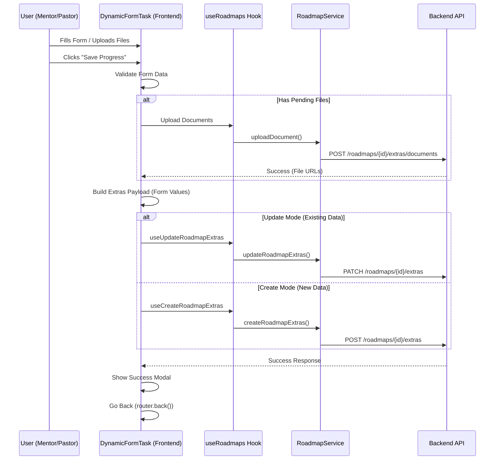

# Roadmap Progress & Save Functionality Documentation

This document outlines how the **"Save Progress"** and **"Update Progress"** functionality works in the `DynamicFormTask` component, specifically within the Mentor's roadmap view.

## 1. Overview

The "Save Progress" button in the roadmap task detail screen is responsible for:
1.  Collecting data from dynamic form fields (Text inputs, Date pickers, Checkboxes).
2.  Handling file uploads (Documents, Media).
3.  Sending this data to the backend via the **Extras API**.

**Current Behavior:**
-   The button saves the **form data** (Extras).
-   It handles **file uploads** associated with the task.
-   It **invalidates queries** to refresh the UI.

**Important Note:** The current implementation **does not explicitly update the task status** (e.g., to "Completed") in the frontend code. It relies on the backend to either infer progress or simply saves the data without changing the completion status.

---

## 2. Process Flow Diagram



---

## 3. API Details

### A. Saving Form Data (Extras)

Depending on whether data already exists, one of two endpoints is called.

**1. Create Extras** (First save)
*   **Endpoint:** `POST /roadmaps/:roadMapId/extras`
*   **Payload:**
    ```json
    {
      "userId": "user_id_here",
      "roadMapId": "roadmap_id_here",
      "nestedRoadMapItemId": "item_id_here",
      "extras": [
        { "type": "TEXT_FIELD", "name": "Field Name", "value": "User Input" },
        { "type": "CHECKBOX", "name": "Is Done?", "value": true }
      ]
    }
    ```

**2. Update Extras** (Subsequent saves)
*   **Endpoint:** `PATCH /roadmaps/:roadMapId/extras`
*   **Query Params:** `?userId=...&nestedRoadMapItemId=...`
*   **Payload:**
    ```json
    {
      "extras": [
        { "type": "TEXT_FIELD", "name": "Field Name", "value": "Updated Input" }
      ]
    }
    ```

### B. File Uploads

*   **Endpoint:** `POST /roadmaps/:roadMapId/extras/documents`
*   **Query Params:** `?userId=...&nestedRoadMapItemId=...&name=fieldName`
*   **Content-Type:** `multipart/form-data`
*   **Payload:** File binary data.

---

## 4. Why "Update Progress" Might Not Be Working

Based on the code analysis of `DynamicFormTask.tsx` and `index.tsx`, here are the likely reasons why the progress (completion status) is not updating as expected:

### Reason 1: No Explicit Status Update
The `handleSubmit` function in `DynamicFormTask.tsx` **only saves the form data (extras)**.
*   It calls `updateExtras.mutateAsync(...)`.
*   It **does not** call any API to set the status to `COMPLETED` or update a percentage.
*   **Fix:** If the backend does not automatically mark the task as complete when extras are saved, you need to add a call to an API that updates the progress status (e.g., `progressService.updateProgress` or similar) inside `handleSubmit`.

### Reason 2: User Context (Mentor vs. Mentee)
In `DynamicFormTask.tsx`, the `userId` is derived from the **currently logged-in user**:
```typescript
const { user } = useAuthStore();
// ...
userId: user.id
```
*   If a **Mentor** is viewing a roadmap item, `user.id` is the **Mentor's ID**.
*   If the Mentor intends to update the progress **for a Mentee**, this will fail to update the Mentee's progress because the data is being saved against the Mentor's ID.
*   **Fix:** The `ItemDetail` screen (`index.tsx`) must accept a `userId` (menteeId) parameter via route params and pass it to `DynamicFormTask`. `DynamicFormTask` should use this passed ID instead of the logged-in user's ID if available.

### Reason 3: Caching
*   The `useRoadmaps.ts` hooks use `staleTime: 0`, which is good.
*   However, if the "Overview" page relies on `useProgress()` and that hook has a long cache time or isn't invalidated by `updateRoadmapExtras`, the progress bar on the previous screen won't move.
*   **Fix:** Ensure `queryClient.invalidateQueries({ queryKey: progressKeys.all })` is triggered (which is currently present in `useUpdateRoadmapExtras`).

## 5. Recommended Actions

1.  **Verify Backend Logic:** Check if `POST/PATCH extras` automatically updates the roadmap item status to "Completed". If not, implement a frontend call to update status.
2.  **Fix User ID for Mentors:** Ensure that when a Mentor opens a task, they are passing the **Mentee's ID** if the intent is to update the Mentee's progress.
